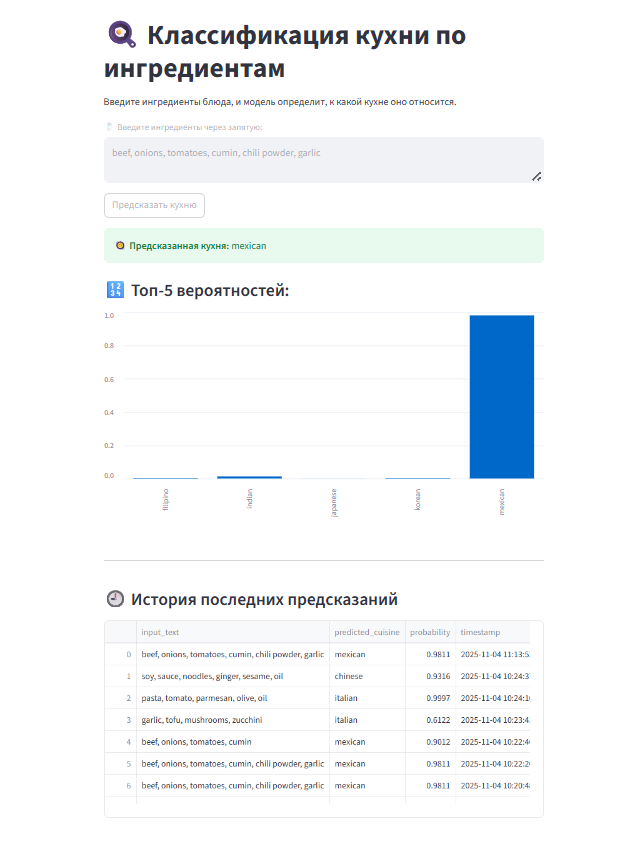

# 🧠 Классификация кухни по ингредиентам

## 📘 Обзор проекта
Проект реализует **пайплайн машинного обучения**, который классифицирует рецепты по типу кухни на основе ингредиентов.  
Модель определяет кухню рецепта, например: *итальянская, индийская, мексиканская* и т.д.

---

## 📂 Структура проекта

### train_models.py
Скрипт для обучения и оценки моделей.

**Основные этапы:**
1. Загружает данные из **SQLite базы** `recipes.db`
2. Создаёт **TF-IDF-векторизацию** ингредиентов с n-граммами (1,3).
3. Обучает и подбирает гиперпараметры для моделей:
   - 🧩 **Multinomial Naive Bayes** (`alpha`: [0.1, 0.5, 1.0])
   - ⚙️ **Logistic Regression** (`C`: [0.01,0.1,1,10,50,100], solver=`saga`, multi_class=`multinomial`)
   - 🌲 **Random Forest** (`n_estimators`: [100,200], `max_depth`: [None,10,20])
   - ⚡ **LightGBM** (`n_estimators=1000`, `num_leaves=256`, `max_depth=16`, `learning_rate=0.1`)
4. Создаёт **ансамбль VotingClassifier** (Logistic Regression + LightGBM, soft voting)
5. Оценивает модели по метрикам:
   - Accuracy, Precision, Recall, F1-score
6. Сохраняет:
   - Лучший классификатор → `model.pkl`
   - TF-IDF-векторизатор → `vectorizer.pkl`
7. Обрабатывает ошибки при загрузке данных и обучении моделей.

### `predict_cuisine.py`
Скрипт для интерактивного предсказания кухни по ингредиентам.

**Этапы:**
- Загружает сохранённую модель и TF-IDF-векторизатор.
- Предсказывает кухню и вероятности для всех классов.
- Сохраняет предсказания в базу данных `recipes.db` (таблица `predictions`).
- Показывает последние предсказания из базы.
- Поддерживает интерактивный ввод ингредиентов через запятую.

### `app.py` (Streamlit)
Веб-интерфейс для предсказаний.

**Особенности:**
- Ввод ингредиентов и визуальное отображение предсказанной кухни.
- Графическое отображение вероятностей по всем классам.
- Поддержка интерактивного выбора ингредиентов.
- Запуск через:
```bash
streamlit run app.py```
- Работает на http://localhost:8501

### `db_setup.py`
Скрипт для для первоначальной инициализации базы данных recipes.db.

**Этапы:**
- Создание таблицы recipes для хранения рецептов (ингредиенты + кухня)
- Создание таблицы predictions для хранения истории предсказаний
- Загрузка данных в БД из файлов json.

### `run_app.cmd`

Удобный скрипт для запуска Streamlit-сервиса в Windows.
**Применение:** `
- Просто дважды щелкните на run_app.cmd — сервис стартует и выдаст инструкцию по остановке.

---

## 🌐 Веб-интерфейс

Пример работы приложения:



---

## ⚡ Использование

### Шаг 1: Инициализация БД
```python db_setup.py```

### Шаг 2: Обучение моделей
```python train_models.py```

### Шаг 3: Предсказание кухни
```python predict_cuisine.py```

### Шаг 4: Веб-интерфейс через Streamlit
```.\run_app.cmd```

Что выполняется:

- Скрипт показывает примеры предсказаний
- Запускается интерактивный режим для ввода новых ингредиентов
- Введи ингредиенты через запятую, например:
```
Enter ingredients: chicken, garlic, soy sauce, ginger
```
- Скрипт выведет:
  - Предсказанную кухню
  - Вероятности для всех кухонь
  - Графическое отображение вероятностей (шкала/гистограмма)
- Для выхода из интерактивного режима введи:
```
quit
```

🛠 Требования

- Python 3.x
- Библиотеки:
```
pip install --upgrade pip
pip install -U scikit-learn lightgbm xgboost numpy pandas
```
- Наличие файлов `train.json` и `test.json`

📂 Источник датасета:

Набор данных рецептов с ингредиентами взят с Kaggle: [Recipe Ingredients Dataset](https://www.kaggle.com/datasets/kaggle/recipe-ingredients-dataset?utm_source=chatgpt.com)
